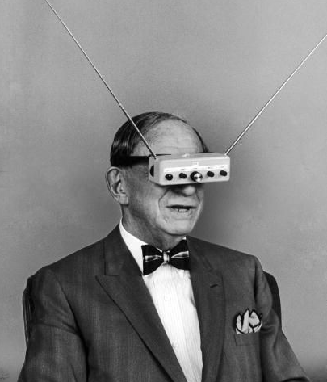

# Learning Machines

Workshop series on data analysis and machine learning for astrophysics

<figure>
</img>
<figcaption>
  https://retrosci-fi.tumblr.com/</a>
 </figcaption>
</figure>


## Table of Contents

### 0 - Python for data analysis 101

Make sure you understand this first

- [Python, first steps on understanding Object-Oriented Programming](./basics/python.ipynb)
- [Python data structures: list, tuple, dict](./basics/list_tuple_dict.ipynb)
- [Numpy: killing the for-loop](./basics/numpy.ipynb)
- [Detecting things (some classical stats fundaments and the question of SNR)](./basics/detection_and_snr.ipynb)
- [Dealing with uncertainties (Gvar, PyNeb and some Monte-Carlo)](./mcmc/uncertainties.ipynb)
- [Detecting stars (Numpy, Astropy, Astroquery, Pandas)](./basics/exercise_star_detection_1.ipynb)


### 1 - Optimization and Modeling

- [Optimization basics](./basics/optimization.ipynb)
- [From classical fit to MCMC fit](./mcmc/mcmc.ipynb)
  - Classical modeling: least-square basics (best fit and classic uncertainty estimation)
  - LSMC: exploring the parameter space with Monte-Carlo
  - Bayesian optimization and the Markov-Chain (chaining drunks)
 
- Example: MCMC from scratch
  - code parallelization (writing multiple papers at the same time)

- Next steps on the Bayesian side of the force : Okham's razor, systematic errors and the power of priors.
 
- examples: 
  - Non-linear model fitting
  - M1, how to deconvolve multiple emission lines along the line-of-sight ?
  - Recover orbital parameters from a luminosity curve
 
### 2 - Old-School Machine Learning

- Detect patterns with convolution
- Pump up your Python (with Cython)
- Classification and modeling
  - PCA: how to start drawing curved lines
  - Walk through random forests and let the machines show you what you fail to see
  - Hierarchical clustering

- examples:
  - Find a thousand planetary nebulae in a 3 billion voxels haystack
  - Redefine the regions of the BPT diagram
 
### 3 - Deep learning
 
Make intelligence emerge from sand and practice ethical slavery

- Creating a brain from scratch
- Become a god and simulate life
- The easy path to the simulation of a galaxy with autoencoders (but you might learn nothing useful from a physicist point-of-view)


## Installation

installation instructions with Anaconda (should work on Linux, Mac OSX, Windows)

### 1. download Miniconda for your OS and python 3.7.

**If you already have [Anaconda](https://www.anaconda.com/) installed go to step 2**

instructions are here: [Miniconda — Conda](https://conda.io/miniconda.html)
1. place the downloaded file on your home directory
2. install it (use the real file name instead of `Miniconda*.sh`)
```bash
bash Miniconda*.sh
```
### 2. install `conda-build` tools
```bash
conda install conda-build
```

### 3. create your environment

create an environment and install needed modules manually
```bash
conda create -n learn python=3 .7 
conda install -n learn numpy scipy bottleneck matplotlib astropy cython h5py pytables pandas
conda install -n learn -c conda-forge pyregion
conda install -n learn -c astropy photutils astroquery
```
if your shell is bash, which is now generally the case for OSX and most linux distributions please do
```
conda init bash
```
If you have a different shell replace bash with the name of your shell.

Now if you have Scisoft installed (which does not goes well with Anaconda/Python... but still you may want to have it)
then please add `export PYTHONPATH=''` at the end of your profile file where some environment variables are defined (e.g. `.bashrc`, `.profile`, `.bash_profile`).

You may then activate your environment with
```
conda activate learn
```
now your prompt should be something like ``(learn)``. If `conda activate learn` does not work. Please do the following `conda init bash` (if bash is your shell

note: you may now have to install `gcc` on Mac OSX or linux if you want to be able to execute the following with no error (see https://discussions.apple.com/thread/8336714). To check that you have gcc installed type `gcc --help` in a terminal. You should see the usage informations displayed.

e.g. to install `gcc` under ubuntu (or debian based distributions):

```bash
sudo apt update
sudo apt install build-essential
```

Then you can install the last python modules with pip (because those modules are not available via anaconda)
```bash
pip install gvar --no-deps
pip install lsqfit --no-deps
pip install pyneb --no-deps
pip install anytree --no-deps
```

### 4. Install jupyter

```bash
conda install -n learn -c conda-forge jupyterlab
```
Run it

```bash
conda activate learn # you don't need to do it if you are already in the orb environment
jupyter lab
```
You should now have your web browser opened and showing the jupyter lab interface !


## General bibliography

* [Géron, A., Hands-On Machine learning with Scikit-learn and TensorFlow](https://www.oreilly.com/library/view/hands-on-machine-learning/9781492032632/)
* [Wall, J.V & Jenkins, C.R., Practical Statistics for Astronomers](https://doi.org/10.1017/CBO9780511536618)
* [Andrae, R., Error estimation in astronomy: A guide](http://arxiv.org/abs/1009)
* [Goodfellow, Bengio, Courville, Deep Learning](http://www.deeplearningbook.org/)
* [Phil, G, Bayesian Logical Data Analysis for the Physical Sciences](https://doi.org/10.1017/CBO9780511791277)
 
